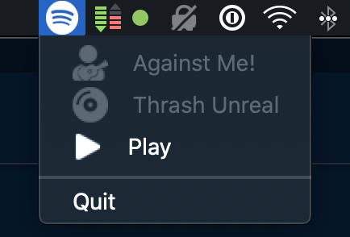

# Spotify Tray Player

Simple Spotify Tray Player

> *Important*: This is only intended for macOS. Not tested on another OS.

## How it works

When you start the app, it will load in the tray and show a Spotify (nothing playing) or music (music playing) icon. Once loaded, you can click on the icon of the app to toggle the music player. 

By right-clicking, you get the current artist, song, play/pause toggle and quit options.